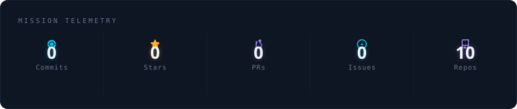

  

 

  

 

  

 

<strong>Um pouco sobre mim</strong>

 

Como estudante de Engenharia de Software, acredito que o verdadeiro propósito da tecnologia é conectar pessoas e simplificar vidas. Meu trabalho como desenvolvedor é exatamente isso: construir pontes com código.

Seja desenvolvendo soluções personalizadas em PHP ou construindo plataformas robustas com WordPress, meu objetivo é criar sistemas que as pessoas realmente gostem de usar — sistemas que sejam intuitivos e, em última análise, economizem tempo para o que realmente importa.

**Currently at** ATI — São Luís, MA

 

  
  

